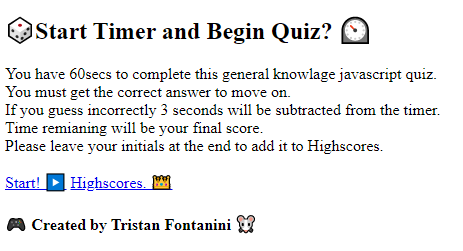
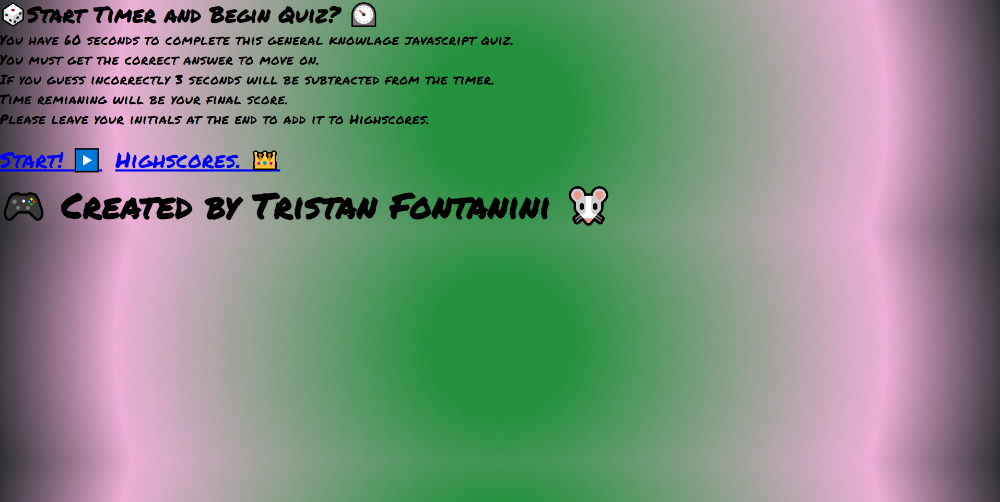
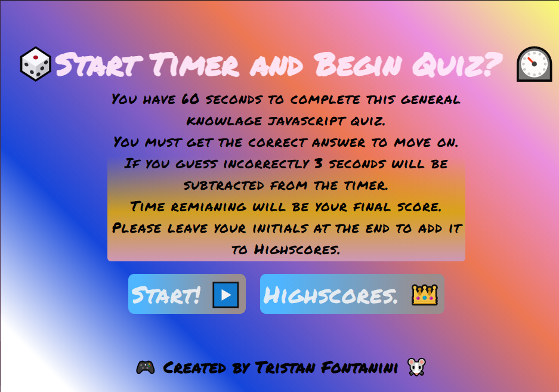
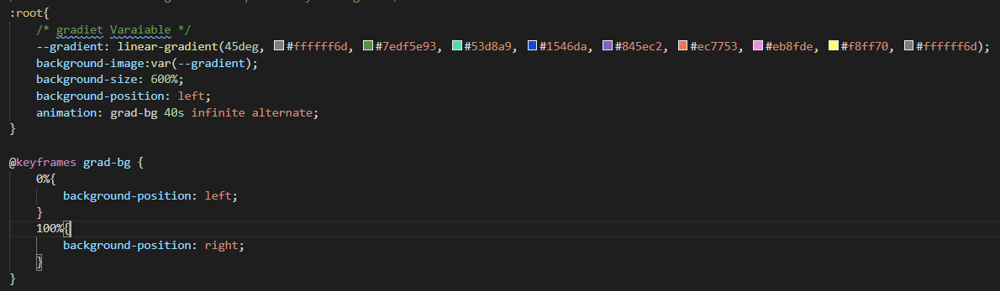
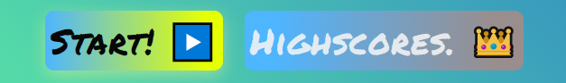
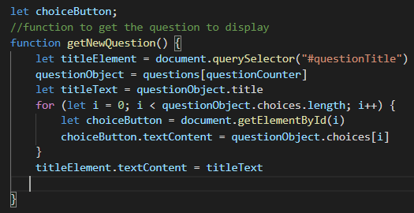
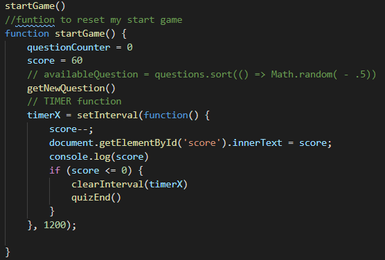
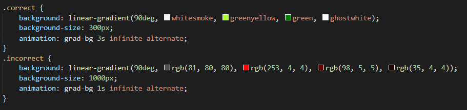
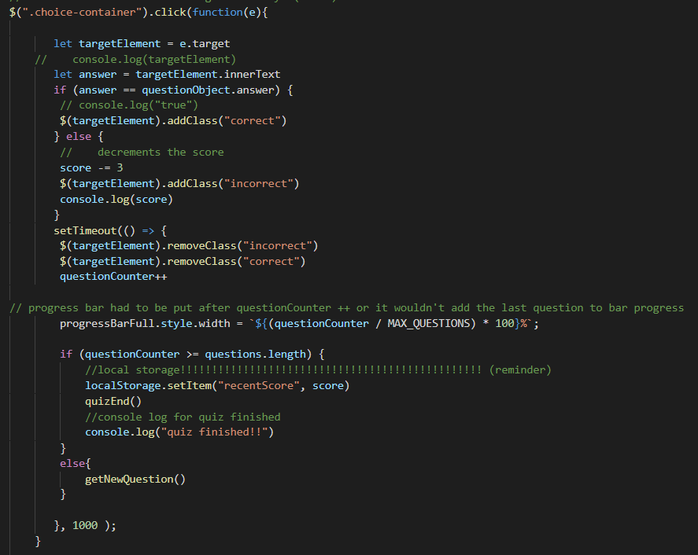
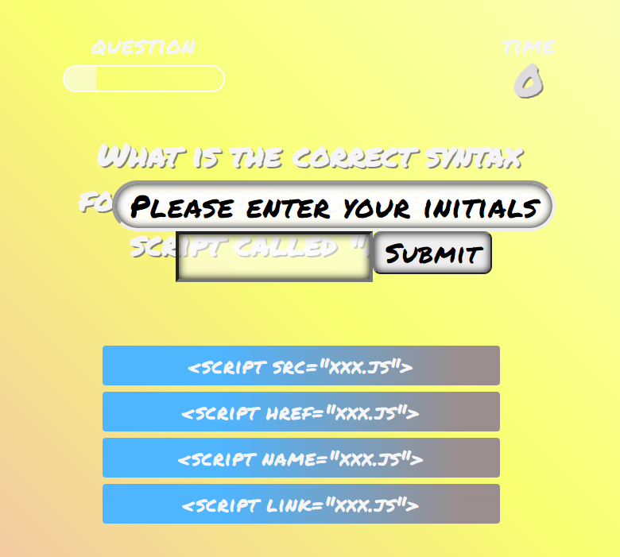

# Javascript-Interactive-Quiz
UWA Web Dev Bootcamp - feb 2021

### https://github.com/Twistedmouse/Javascript-Interactive-Quiz
### https://twistedmouse.github.io/Javascript-Interactive-Quiz/

---
## The task at hand:

 the task we were giving was to create a multi choice quiz on javascript. 

---
## Screenshots and Description:

I started with making the first html page. I used there pages all up. landing page, quiz page and high scores. 

First html: 

 

I think wanted to decide on a colour scheme. My first few examples were pretty bad:

 

That final image i then tweeked with a bit and animated the colour gradient for a more interesting look.

Heres and snippet of the gradient background: 

 

I also added a hover effect for my button. i had alot of fun with the css of this project.
 

 

I did have a bit of trouble with getting the questions to appear on the boxes i made but i got there in the end.

 

I also created a start function to reset everything/set up the page: 

As you can see I did plan on making a randomise function but scrapped the idea cos I was running out of time.

I believe the timer was the easiest function to make. 
 

 As you can see on the demo below i have a correct and incorrect animation on the buttons.If incorrect the score/timer goes down by 3.And I also added a progress bar for some flair snippets will be under demo.

 

And once the score hits 0 or there is no questions left the submit button and label that is hidden will appear. The score is then saved in local storage. 

The user is then taken to the high score screen.

 

Unfortunately due to time restraints i couldn't get my function adding local storage to the highscore board to work. but i will come back to this a resubmit!! 

---

## future plans:

I plan to come back to this project and finish it fully i feel like im very close to finishing the final function i also want to disable the quiz buttons when the submit label is up. 

Something i learnt from this is to get functionality working before style its easy to get carried away with the world of css if i spent less time on the style i may have completed this on time. 

---